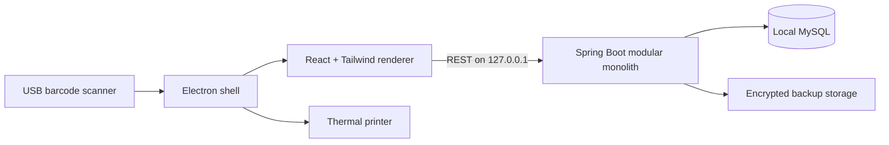

# Simplified Billing & Inventory Management System

An offline-first, desktop-installable billing and inventory application for small retail and
grocery shops.

This repository contains the technical foundation and the completed **Store Setup &
Authentication** module:

- Java 21 and Spring Boot 3.5 modular-monolith backend
- MySQL persistence with Flyway migrations
- first-run shop/GST/receipt configuration and owner bootstrap
- Spring Security JWT access tokens and rotating, hashed refresh tokens
- BCrypt password hashing, login throttling, roles, and local user administration
- shop settings and receipt-logo management with optimistic concurrency
- consistent API errors and request correlation IDs
- React 19 and Tailwind CSS setup, login, settings, users, and account screens
- security-hardened Electron shell
- operating-system-encrypted desktop session persistence
- optional development MySQL Compose configuration

Inventory, purchases, POS, Khata and reports remain separate implementation milestones.

## Documentation

- [Software Requirements Specification](./Simplified-Billing-Inventory-SRS.pdf)
- [Editable SRS source](./Simplified-Billing-Inventory-SRS.html)

## Architecture



The renderer has no direct Node.js, filesystem or database access. Electron exposes only a
narrow preload bridge. Spring Boot and MySQL are bound to the local workstation in the
single-device deployment profile.

## Repository layout

```text
Billing/
├── backend/                         Spring Boot backend
│   ├── src/main/java/
│   │   └── com/simplifiedbilling/
│   │       ├── shared/              Configuration, errors and cross-cutting code
│   │       └── system/              Local readiness API
│   ├── src/main/resources/
│   │   └── db/migration/            Flyway migrations
│   └── pom.xml
├── desktop/                         Electron + React application
│   ├── electron/                    Main and preload processes
│   ├── src/                         React renderer
│   ├── electron-builder.yml         Windows installer configuration
│   └── package.json
├── compose.yaml                     Optional development MySQL
├── .env.example                     Development environment template
└── README.md
```

## Current technology versions

| Component | Version |
|---|---:|
| Java | 21 |
| Spring Boot | 3.5.14 |
| MySQL development image | 8.4.10 LTS |
| React | 19.2.8 |
| Electron | 43.2.0 |
| Vite | 8.1.5 |
| Tailwind CSS | 4.3.3 |

Versions are pinned through Maven dependency management and `desktop/package-lock.json` once
dependencies are installed.

## Development prerequisites

Install the following tools:

1. Git
2. JDK 21
3. Maven 3.9+
4. Node.js 24 LTS or another version supported by the pinned Vite release
5. npm
6. MySQL 8.4 LTS, or Docker Desktop for the optional Compose workflow

Confirm the primary tools:

```powershell
java -version
mvn -version
node --version
npm --version
```

Docker is a development convenience only. The final desktop installer will manage its own local
runtime and will not require Docker on a shop computer.

## Quick start

### 1. Clone and enter the repository

```powershell
git clone <repository-url>
Set-Location Billing
```

If you already have this workspace open, run all commands from the repository root.

### 2. Create local configuration

Copy the environment template:

```powershell
Copy-Item .env.example .env
```

Edit `.env` and replace the example database password with a long development password.

`.env` is ignored by Git. Do not commit database passwords, JWT secrets, backup passwords or
installer signing credentials.

### 3. Start MySQL

Choose one of the following approaches.

#### Option A: Docker Compose

Docker Desktop must be installed and running.

PowerShell does not automatically load `.env` values into the current process, but Docker Compose
reads the repository `.env` file:

```powershell
docker compose up -d mysql
docker compose ps
```

Wait until the container reports `healthy`.

To stop MySQL without deleting its data:

```powershell
docker compose stop mysql
```

Do not run `docker compose down --volumes` unless you intentionally want to delete the development
database.

#### Option B: Locally installed MySQL

Create the development database and application account with an administrator account:

```sql
CREATE DATABASE billing
    CHARACTER SET utf8mb4
    COLLATE utf8mb4_0900_ai_ci;

CREATE USER 'billing_app'@'127.0.0.1'
    IDENTIFIED BY 'choose-a-long-development-password';

GRANT ALL PRIVILEGES ON billing.* TO 'billing_app'@'127.0.0.1';
FLUSH PRIVILEGES;
```

Keep MySQL bound to the local computer for the single-workstation development profile.
The `billing` database must exist before the backend starts; Flyway creates and validates its
tables.

### 4. Load backend environment variables

For the current PowerShell session:

```powershell
$env:BILLING_DB_URL = "jdbc:mysql://127.0.0.1:3306/billing?useUnicode=true&characterEncoding=UTF-8&connectionCollation=utf8mb4_0900_ai_ci&serverTimezone=UTC&useSSL=false&allowPublicKeyRetrieval=true"
$env:BILLING_DB_USERNAME = "billing_app"
$env:BILLING_DB_PASSWORD = "the-password-you-configured"
$env:BILLING_SERVER_ADDRESS = "127.0.0.1"
$env:BILLING_SERVER_PORT = "8080"
$jwtBytes = New-Object byte[] 48
[Security.Cryptography.RandomNumberGenerator]::Fill($jwtBytes)
$env:BILLING_JWT_SECRET_BASE64 = [Convert]::ToBase64String($jwtBytes)
```

Keep the generated JWT secret for this installation. Changing it signs out every current access
token; users can sign in again with their passwords. The backend intentionally has no default
database password.

### 5. Run the backend

```powershell
mvn -f backend/pom.xml spring-boot:run
```

The first startup downloads Maven dependencies and applies Flyway migrations. Verify readiness:

```powershell
Invoke-RestMethod http://127.0.0.1:8080/api/v1/system/health
```

Expected shape:

```json
{
  "status": "UP",
  "application": "billing-backend",
  "version": "development",
  "database": "UP",
  "javaVersion": "21",
  "timestamp": "..."
}
```

Health, setup status, one-time setup, login, refresh, and logout are public. Every business,
settings, account, and user-management endpoint requires a valid JWT access token.

### 6. Install desktop dependencies

In a second PowerShell terminal:

```powershell
Set-Location desktop
npm ci
```

Use `npm install` only when intentionally changing dependencies. Normal setup should use the
committed lock file through `npm ci`.

### 7. Run the desktop application

Keep MySQL and the backend running, then execute:

```powershell
npm run dev
```

This starts the Vite renderer on `127.0.0.1:5173`, waits for it to become available and opens the
Electron desktop window.

The readiness panel should display:

- Backend: `UP`
- Database: `UP`
- Application: `development`
- Java: `21`

On the first successful connection, the desktop application opens a one-time setup wizard instead
of the sign-in page. Enter the shop identity, address, GST status, receipt defaults, and first owner
account. The backend creates the shop and owner in one serializable transaction. If either write
fails, neither record is kept.

After setup, sign-in/session restoration and all settings APIs require authentication. The public
setup endpoint rejects every later bootstrap attempt.

## Build and test

### Backend tests

```powershell
mvn -f backend/pom.xml test
```

Fast context and MVC integration tests use an isolated H2 test profile. Service and controller
tests use JUnit 5, AssertJ, Mockito, and Spring MVC test utilities.

Run release verification with the mandatory coverage gate:

```powershell
mvn -f backend/pom.xml clean verify
```

The build fails below 90% backend line coverage or 80% branch coverage. The HTML report is
generated at `backend/target/site/jacoco/index.html`.

| Metric | Current coverage | Enforced gate |
|---|---:|---:|
| Lines | 98.01% | 90% |
| Branches | 83.82% | 80% |

To apply the real Flyway migration to a disposable MySQL 8.4 container, start Docker and run:

```powershell
mvn -f backend/pom.xml -P integration-tests verify
```

The integration-test profile intentionally requires Docker and is not part of the fast default
test command.

### Backend production JAR

```powershell
mvn -f backend/pom.xml clean package
```

Output:

```text
backend/target/billing-backend.jar
```

### Desktop type check and production renderer

```powershell
npm --prefix desktop run typecheck
npm --prefix desktop run build
```

Output:

```text
desktop/dist/
```

### Windows installer scaffold

Build the backend JAR first, then run:

```powershell
npm --prefix desktop run package:win
```

Output is written to `desktop/release/`.

> The current packaging file is a foundation, not yet the final shop installer. The packaged
> application can include the backend JAR, but the private Java runtime, managed MySQL
> lifecycle, database initialization, encrypted backup recovery and installer signing are part of
> the desktop-operations milestone.

> **Distribution review required:** MySQL Community Edition is GPL-licensed. Before redistributing
> MySQL server binaries inside a proprietary installer, obtain project-specific licensing review
> or an appropriate commercial license. This foundation connects to MySQL but does not vendor
> MySQL server binaries.

## Configuration reference

| Variable | Required | Default | Purpose |
|---|---|---|---|
| `BILLING_DB_URL` | No | `jdbc:mysql://127.0.0.1:3306/billing?...` | JDBC connection URL |
| `BILLING_DB_USERNAME` | No | `billing_app` | MySQL application account |
| `BILLING_DB_PASSWORD` | **Yes** | None | MySQL application password |
| `BILLING_DB_ROOT_PASSWORD` | Compose only | None | MySQL root password used to initialize the development container |
| `BILLING_SERVER_ADDRESS` | No | `127.0.0.1` | Backend bind address |
| `BILLING_SERVER_PORT` | No | `8080` | Backend port |
| `BILLING_BACKEND_URL` | No | `http://127.0.0.1:8080` | Vite development proxy target |
| `BILLING_API_BASE_URL` | No | `http://127.0.0.1:8080` | Electron renderer API location |
| `BILLING_BACKEND_JAR` | No | Packaged resource path | Optional backend JAR to launch from Electron |
| `BILLING_LOG_FILE` | No | `logs/billing-backend.log` | Backend rolling-log location |
| `BILLING_JWT_ISSUER` | No | `simplified-billing-desktop` | Expected JWT issuer |
| `BILLING_JWT_SECRET_BASE64` | Recommended | Development-only fallback | Base64 HMAC secret; decode length must be at least 32 bytes |
| `BILLING_ACCESS_TOKEN_TTL` | No | `15m` | Short-lived access-token duration |
| `BILLING_REFRESH_TOKEN_TTL` | No | `7d` | Maximum rotating session duration |

## Database migrations

Flyway migrations are stored under:

```text
backend/src/main/resources/db/migration/
```

Rules:

1. Never edit a migration that has been applied to a shared or production database.
2. Add a new incremented migration for every schema change.
3. Do not use Hibernate automatic schema creation outside isolated tests.
4. Test migrations against MySQL before release.
5. Create a verified backup before installer upgrades apply migrations.

The current migrations create:

- `billing.app_settings`
- `billing.audit_events`
- `billing.shop_profiles`
- `billing.users`
- `billing.user_roles`
- `billing.refresh_tokens`
- supporting audit indexes

## Store setup and authentication API

| Method | Endpoint | Access | Purpose |
|---|---|---|---|
| `GET` | `/api/v1/setup/status` | Public | Determine whether first-run setup is required |
| `POST` | `/api/v1/setup` | Public until configured | Atomically create the shop and first owner |
| `POST` | `/api/v1/auth/login` | Public | Verify local credentials and create a session |
| `POST` | `/api/v1/auth/refresh` | Public | Rotate a refresh token and issue a new access token |
| `POST` | `/api/v1/auth/logout` | Public | Revoke the supplied refresh token |
| `GET` | `/api/v1/auth/me` | Authenticated | Return the current user |
| `POST` | `/api/v1/auth/change-password` | Authenticated | Change password and revoke all refresh tokens |
| `GET/PUT` | `/api/v1/store` | Authenticated / Owner or Admin | Read or update shop settings |
| `GET/PUT/DELETE` | `/api/v1/store/logo` | Authenticated / Owner or Admin | Read, upload, or remove receipt logo |
| `GET/POST/PATCH` | `/api/v1/users` | Owner or Admin | List, create, or update local users |
| `POST` | `/api/v1/users/{id}/reset-password` | Owner or Admin | Reset a user password and revoke sessions |

The first account receives `OWNER` and `ADMIN`. Supported roles are `OWNER`, `ADMIN`, `CASHIER`,
`INVENTORY_MANAGER`, and `VIEWER`. Only an owner can create or modify another owner, the signed-in
user cannot deactivate themselves, and the last active owner cannot be removed.

## Backend module conventions

Business modules use package-by-feature:

```text
com.simplifiedbilling.<module>/
|-- controller/
|-- dto/
|-- mapper/
|-- service/
|   `-- impl/
|-- domain/
`-- repository/
```

Architecture rules:

- `controller/` depends on service interfaces and DTOs, never repositories or implementations
- `service/` contains use-case contracts; `service/impl/` owns transactions and orchestration
- `mapper/` owns API/domain conversion; domain entities do not import DTOs
- controllers handle HTTP concerns only
- DTOs are used at API boundaries
- transaction boundaries belong in service implementations
- modules communicate through service interfaces
- one module must not access another module's repository
- financial and stock history is reversed, not deleted
- checkout calculations are authoritative on the backend

## Desktop security baseline

- `contextIsolation` is enabled
- renderer Node.js integration is disabled
- Chromium sandboxing is enabled
- window creation and external navigation are denied
- runtime permissions are denied by default
- production assets use the private `billing://app` protocol
- the renderer receives only a narrow runtime-information bridge
- refresh tokens are encrypted with Electron `safeStorage`; access tokens remain in renderer memory
- the backend and database bind to loopback in the default profile

Do not expose generic filesystem, shell or arbitrary IPC execution methods to React components.

## Troubleshooting

### Desktop says “Local service unavailable”

Check in order:

```powershell
Invoke-RestMethod http://127.0.0.1:8080/api/v1/system/health
Get-NetTCPConnection -LocalPort 8080 -ErrorAction SilentlyContinue
```

If the health request fails, inspect the backend terminal and `logs/billing-backend.log`.

### Backend cannot connect to MySQL

Verify:

- MySQL is running
- the database is named `billing`
- the application account is `billing_app`
- `BILLING_DB_PASSWORD` matches the configured role
- port `3306` is not used by a different MySQL installation

For Compose:

```powershell
docker compose ps
docker compose logs mysql
```

### Flyway validation fails

Do not delete Flyway history or edit an applied migration. Confirm that the correct database is
selected and create a new corrective migration.

### Port 5173 is already in use

The renderer uses a strict port because Electron expects that address. Stop the other process or
change both the Vite port and `BILLING_RENDERER_URL` together.

### Electron dependency installation fails

Electron downloads a platform binary during `npm ci`. Check proxy/firewall configuration and retry
from a network that permits the npm registry and Electron release downloads.

On Windows networks with a corporate certificate authority, allow Node.js to use the Windows
certificate store before retrying Electron's binary installer:

```powershell
$env:NODE_USE_SYSTEM_CA = "1"
Set-Location desktop
npm exec -- install-electron --no
npm run dev
```

Do not set `NODE_TLS_REJECT_UNAUTHORIZED=0`; it disables certificate validation.

## Next implementation milestone

The next milestone is **Inventory Management**:

1. category, unit, product, barcode, and stock-ledger schema
2. product DTOs and CRUD APIs
3. custom barcode allocation
4. stock adjustments with reason codes
5. low-stock queries and notifications
6. inventory desktop screens and tests
