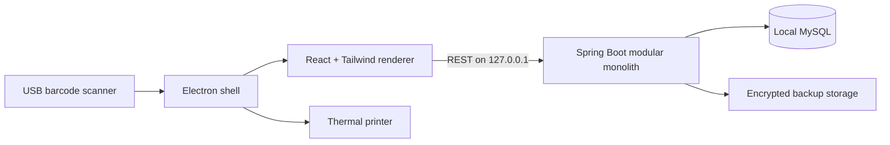

# Simplified Billing & Inventory Management System

An offline-first, desktop-installable billing and inventory application for small retail and
grocery shops.

This repository currently contains the **technical foundation milestone**:

- Java 21 and Spring Boot 3.5 modular-monolith backend
- MySQL persistence with Flyway migrations
- deny-by-default Spring Security configuration
- consistent API errors and request correlation IDs
- React 19 and Tailwind CSS desktop renderer
- security-hardened Electron shell
- local backend/database readiness screen
- optional development MySQL Compose configuration

Store setup, JWT authentication, inventory, purchases, POS, Khata and reports will be added in
separate implementation milestones.

## Documentation

- [Software Requirements Specification](./Simplified-Billing-Inventory-SRS.pdf)
- [Editable SRS source](./Simplified-Billing-Inventory-SRS.html)

## Architecture



The renderer has no direct Node.js, filesystem or database access. Electron exposes only a
narrow preload bridge. Spring Boot and MySQL are bound to the local workstation in the
single-device deployment profile.

## Repository layout

```text
Billing/
├── backend/                         Spring Boot backend
│   ├── src/main/java/
│   │   └── com/simplifiedbilling/
│   │       ├── shared/              Configuration, errors and cross-cutting code
│   │       └── system/              Local readiness API
│   ├── src/main/resources/
│   │   └── db/migration/            Flyway migrations
│   └── pom.xml
├── desktop/                         Electron + React application
│   ├── electron/                    Main and preload processes
│   ├── src/                         React renderer
│   ├── electron-builder.yml         Windows installer configuration
│   └── package.json
├── compose.yaml                     Optional development MySQL
├── .env.example                     Development environment template
└── README.md
```

## Current technology versions

| Component | Version |
|---|---:|
| Java | 21 |
| Spring Boot | 3.5.14 |
| MySQL development image | 8.4.10 LTS |
| React | 19.2.8 |
| Electron | 43.2.0 |
| Vite | 8.1.5 |
| Tailwind CSS | 4.3.3 |

Versions are pinned through Maven dependency management and `desktop/package-lock.json` once
dependencies are installed.

## Development prerequisites

Install the following tools:

1. Git
2. JDK 21
3. Maven 3.9+
4. Node.js 24 LTS or another version supported by the pinned Vite release
5. npm
6. MySQL 8.4 LTS, or Docker Desktop for the optional Compose workflow

Confirm the primary tools:

```powershell
java -version
mvn -version
node --version
npm --version
```

Docker is a development convenience only. The final desktop installer will manage its own local
runtime and will not require Docker on a shop computer.

## Quick start

### 1. Clone and enter the repository

```powershell
git clone <repository-url>
Set-Location Billing
```

If you already have this workspace open, run all commands from the repository root.

### 2. Create local configuration

Copy the environment template:

```powershell
Copy-Item .env.example .env
```

Edit `.env` and replace the example database password with a long development password.

`.env` is ignored by Git. Do not commit database passwords, JWT secrets, backup passwords or
installer signing credentials.

### 3. Start MySQL

Choose one of the following approaches.

#### Option A: Docker Compose

Docker Desktop must be installed and running.

PowerShell does not automatically load `.env` values into the current process, but Docker Compose
reads the repository `.env` file:

```powershell
docker compose up -d mysql
docker compose ps
```

Wait until the container reports `healthy`.

To stop MySQL without deleting its data:

```powershell
docker compose stop mysql
```

Do not run `docker compose down --volumes` unless you intentionally want to delete the development
database.

#### Option B: Locally installed MySQL

Create the development database and application account with an administrator account:

```sql
CREATE DATABASE billing
    CHARACTER SET utf8mb4
    COLLATE utf8mb4_0900_ai_ci;

CREATE USER 'billing_app'@'127.0.0.1'
    IDENTIFIED BY 'choose-a-long-development-password';

GRANT ALL PRIVILEGES ON billing.* TO 'billing_app'@'127.0.0.1';
FLUSH PRIVILEGES;
```

Keep MySQL bound to the local computer for the single-workstation development profile.
The `billing` database must exist before the backend starts; Flyway creates and validates its
tables.

### 4. Load backend environment variables

For the current PowerShell session:

```powershell
$env:BILLING_DB_URL = "jdbc:mysql://127.0.0.1:3306/billing?useUnicode=true&characterEncoding=UTF-8&connectionCollation=utf8mb4_0900_ai_ci&serverTimezone=UTC&useSSL=false&allowPublicKeyRetrieval=true"
$env:BILLING_DB_USERNAME = "billing_app"
$env:BILLING_DB_PASSWORD = "the-password-you-configured"
$env:BILLING_SERVER_ADDRESS = "127.0.0.1"
$env:BILLING_SERVER_PORT = "8080"
```

The backend intentionally has no default database password.

### 5. Run the backend

```powershell
mvn -f backend/pom.xml spring-boot:run
```

The first startup downloads Maven dependencies and applies Flyway migrations. Verify readiness:

```powershell
Invoke-RestMethod http://127.0.0.1:8080/api/v1/system/health
```

Expected shape:

```json
{
  "status": "UP",
  "application": "billing-backend",
  "version": "development",
  "database": "UP",
  "javaVersion": "21",
  "timestamp": "..."
}
```

Only health endpoints are public in the current milestone. Other backend endpoints are denied
until JWT authentication is implemented.

### 6. Install desktop dependencies

In a second PowerShell terminal:

```powershell
Set-Location desktop
npm ci
```

Use `npm install` only when intentionally changing dependencies. Normal setup should use the
committed lock file through `npm ci`.

### 7. Run the desktop application

Keep MySQL and the backend running, then execute:

```powershell
npm run dev
```

This starts the Vite renderer on `127.0.0.1:5173`, waits for it to become available and opens the
Electron desktop window.

The readiness panel should display:

- Backend: `UP`
- Database: `UP`
- Application: `development`
- Java: `21`

## Build and test

### Backend tests

```powershell
mvn -f backend/pom.xml test
```

Fast context tests use an isolated H2 test profile. Additional repository and concurrency tests
will be added with inventory and billing.

To apply the real Flyway migration to a disposable MySQL 8.4 container, start Docker and run:

```powershell
mvn -f backend/pom.xml -P integration-tests verify
```

The integration-test profile intentionally requires Docker and is not part of the fast default
test command.

### Backend production JAR

```powershell
mvn -f backend/pom.xml clean package
```

Output:

```text
backend/target/billing-backend.jar
```

### Desktop type check and production renderer

```powershell
npm --prefix desktop run typecheck
npm --prefix desktop run build
```

Output:

```text
desktop/dist/
```

### Windows installer scaffold

Build the backend JAR first, then run:

```powershell
npm --prefix desktop run package:win
```

Output is written to `desktop/release/`.

> The current packaging file is a foundation, not yet the final shop installer. The packaged
> application can include the backend JAR, but the private Java runtime, managed MySQL
> lifecycle, database initialization, encrypted backup recovery and installer signing are part of
> the desktop-operations milestone.

> **Distribution review required:** MySQL Community Edition is GPL-licensed. Before redistributing
> MySQL server binaries inside a proprietary installer, obtain project-specific licensing review
> or an appropriate commercial license. This foundation connects to MySQL but does not vendor
> MySQL server binaries.

## Configuration reference

| Variable | Required | Default | Purpose |
|---|---|---|---|
| `BILLING_DB_URL` | No | `jdbc:mysql://127.0.0.1:3306/billing?...` | JDBC connection URL |
| `BILLING_DB_USERNAME` | No | `billing_app` | MySQL application account |
| `BILLING_DB_PASSWORD` | **Yes** | None | MySQL application password |
| `BILLING_DB_ROOT_PASSWORD` | Compose only | None | MySQL root password used to initialize the development container |
| `BILLING_SERVER_ADDRESS` | No | `127.0.0.1` | Backend bind address |
| `BILLING_SERVER_PORT` | No | `8080` | Backend port |
| `BILLING_BACKEND_URL` | No | `http://127.0.0.1:8080` | Vite development proxy target |
| `BILLING_API_BASE_URL` | No | `http://127.0.0.1:8080` | Electron renderer API location |
| `BILLING_BACKEND_JAR` | No | Packaged resource path | Optional backend JAR to launch from Electron |
| `BILLING_LOG_FILE` | No | `logs/billing-backend.log` | Backend rolling-log location |

## Database migrations

Flyway migrations are stored under:

```text
backend/src/main/resources/db/migration/
```

Rules:

1. Never edit a migration that has been applied to a shared or production database.
2. Add a new incremented migration for every schema change.
3. Do not use Hibernate automatic schema creation outside isolated tests.
4. Test migrations against MySQL before release.
5. Create a verified backup before installer upgrades apply migrations.

The current baseline creates:

- `billing.app_settings`
- `billing.audit_events`
- supporting audit indexes

## Backend module conventions

Business modules use package-by-feature:

```text
com.simplifiedbilling.<module>
├── controller
├── dto
├── service
├── domain
└── repository
```

Architecture rules:

- controllers handle HTTP concerns only
- DTOs are used at API boundaries
- transaction boundaries belong in application services
- modules communicate through service interfaces
- one module must not access another module's repository
- financial and stock history is reversed, not deleted
- checkout calculations are authoritative on the backend

## Desktop security baseline

- `contextIsolation` is enabled
- renderer Node.js integration is disabled
- Chromium sandboxing is enabled
- window creation and external navigation are denied
- runtime permissions are denied by default
- production assets use the private `billing://app` protocol
- the renderer receives only a narrow runtime-information bridge
- the backend and database bind to loopback in the default profile

Do not expose generic filesystem, shell or arbitrary IPC execution methods to React components.

## Troubleshooting

### Desktop says “Local service unavailable”

Check in order:

```powershell
Invoke-RestMethod http://127.0.0.1:8080/api/v1/system/health
Get-NetTCPConnection -LocalPort 8080 -ErrorAction SilentlyContinue
```

If the health request fails, inspect the backend terminal and `logs/billing-backend.log`.

### Backend cannot connect to MySQL

Verify:

- MySQL is running
- the database is named `billing`
- the application account is `billing_app`
- `BILLING_DB_PASSWORD` matches the configured role
- port `3306` is not used by a different MySQL installation

For Compose:

```powershell
docker compose ps
docker compose logs mysql
```

### Flyway validation fails

Do not delete Flyway history or edit an applied migration. Confirm that the correct database is
selected and create a new corrective migration.

### Port 5173 is already in use

The renderer uses a strict port because Electron expects that address. Stop the other process or
change both the Vite port and `BILLING_RENDERER_URL` together.

### Electron dependency installation fails

Electron downloads a platform binary during `npm ci`. Check proxy/firewall configuration and retry
from a network that permits the npm registry and Electron release downloads.

## Next implementation milestone

The next milestone is **Store Setup and Authentication**:

1. shop configuration tables and DTOs
2. first-run setup state
3. administrator bootstrap
4. BCrypt/Argon2 password storage
5. JWT access and refresh-token rotation
6. login, logout and password-change APIs
7. desktop login and first-run setup screens
8. security and integration tests
