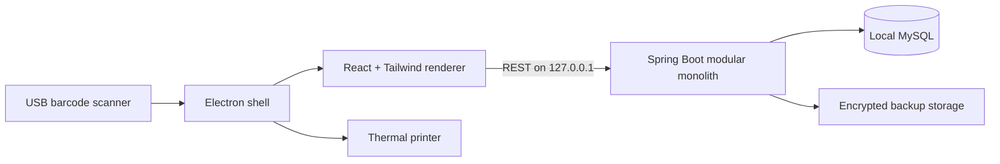

# Simplified Billing & Inventory Management System

An offline-first, desktop-installable billing and inventory application for small retail and
grocery shops.

This repository contains the technical foundation and the completed **Store Setup &
Authentication**, **Inventory Management**, **Point of Sale**, **Sales Returns & Refunds**,
**Khata**, **Dashboard & Reports**, and **Purchase & Supplier Management** modules:

- Java 21 and Spring Boot 3.5 modular-monolith backend
- MySQL persistence with Flyway migrations
- first-run shop/GST/receipt configuration and owner bootstrap
- Spring Security JWT access tokens and rotating, hashed refresh tokens
- BCrypt password hashing, login throttling, roles, and local user administration
- shop settings and receipt-logo management with optimistic concurrency
- consistent API errors and request correlation IDs
- category, product, barcode, inventory-balance and immutable stock-ledger services
- paged product search, low-stock alerts and locked stock adjustments
- server-authoritative POS quotes, GST, discounts, rounding and idempotent checkout
- atomically locked sale deductions, immutable invoices, line snapshots and payment records
- full and partial sales returns, controlled cancellation and cumulative quantity protection
- saleable or damaged return classification, refund records and Udhaar balance reversal
- original-price, discount, GST and purchase-cost return snapshots with printable credit notes
- scanner-first 70/30 POS workspace with theme-aware cart/checkout surfaces and customer capture for every payment mode
- 58 mm and 80 mm thermal receipt preview and operating-system printing
- searchable invoice archive with status, payment, date, amount and sort filters
- thermal/A4 reprints, offline PDF export, selected-invoice CSV export and copy-to-share summaries
- per-invoice activity history for sale, return, cancellation, reprint, PDF and sharing actions
- one-click return/cancellation handoff from invoice details and an `F6` last-invoice shortcut in POS
- customer accounts, append-only credit statements and locked outstanding balances
- atomic Udhaar checkout plus idempotent full or partial settlements
- Khata receivable summary, customer search, maintenance and statement workspace
- store-timezone-aware sales, GST, payment-mode and gross-margin reporting
- owner dashboard with daily/monthly/yearly KPIs, revenue trends, top products, recent activity, inventory alerts and customer exposure
- printable A4 period reports and UTF-8 CSV export
- supplier contacts, payable balances, statements and idempotent supplier payments
- purchase receiving with GST-aware immutable line snapshots and supplier invoice references
- pessimistically locked stock increases and automatic latest-purchase-cost updates
- purchase and supplier desktop workspaces with due filters and detailed receiving history
- full and partial purchase returns with cumulative source-line quantity protection
- locked supplier-return stock reversals and two-sided payable/supplier-credit accounting
- supplier analytics with date filters, CSV export and printable A4 summaries
- Material-inspired desktop design with Light, Dark and System appearance modes
- five locally persisted color palettes: Ocean, Teal, Rose, Amber and Violet
- React 19 and Tailwind CSS setup, login, POS, inventory, purchasing, Khata, reports, settings, users, and account screens
- security-hardened Electron shell
- operating-system-encrypted desktop session persistence
- optional development MySQL Compose configuration
- recoverable and held POS carts plus persistent failed-receipt print retry
- inventory CSV preview/import/export and locally persisted physical-count drafts
- one-click AES-256-GCM full database/configuration backup and restore with startup recovery and a pre-restore safety backup
- local diagnostics, printer discovery/test print and sanitized support export
- signed offline-update verification with a mandatory pre-update backup

Managed MySQL distribution, a minimized private Java runtime, installer signing and clean-machine
acceptance remain release-engineering gates because they depend on licensing decisions and private
signing material rather than application business logic.

## Documentation

- [Software Requirements Specification](./Simplified-Billing-Inventory-SRS.pdf)
- [Editable SRS source](./Simplified-Billing-Inventory-SRS.html)
- [Step-by-step Windows EXE build guide](./Exe.md)

## Architecture



The renderer has no direct Node.js, filesystem or database access. Electron exposes only a
narrow preload bridge. Spring Boot and MySQL are bound to the local workstation in the
single-device deployment profile.

## Repository layout

```text
Billing/
├── backend/                         Spring Boot backend
│   ├── src/main/java/
│   │   └── com/simplifiedbilling/
│   │       ├── shared/              Configuration, errors and cross-cutting code
│   │       └── system/              Local readiness API
│   ├── src/main/resources/
│   │   └── db/migration/            Flyway migrations
│   └── pom.xml
├── desktop/                         Electron + React application
│   ├── electron/                    Main and preload processes
│   ├── src/                         React renderer
│   ├── electron-builder.yml         Windows installer configuration
│   └── package.json
├── compose.yaml                     Optional development MySQL
├── .env.example                     Development environment template
└── README.md
```

## Current technology versions

| Component | Version |
|---|---:|
| Java | 21 |
| Spring Boot | 3.5.14 |
| MySQL development image | 8.4.10 LTS |
| React | 19.2.8 |
| Electron | 43.2.0 |
| Vite | 8.1.5 |
| Tailwind CSS | 4.3.3 |

Versions are pinned through Maven dependency management and `desktop/package-lock.json` once
dependencies are installed.

## Development prerequisites

Install the following tools:

1. Git
2. JDK 21
3. Maven 3.9+
4. Node.js 24 LTS or another version supported by the pinned Vite release
5. npm
6. MySQL 8.4 LTS, or Docker Desktop for the optional Compose workflow

Confirm the primary tools:

```powershell
java -version
mvn -version
node --version
npm --version
```

Docker is a development convenience only. The final desktop installer will manage its own local
runtime and will not require Docker on a shop computer.

## Quick start

### 1. Clone and enter the repository

```powershell
git clone <repository-url>
Set-Location Billing
```

If you already have this workspace open, run all commands from the repository root.

### 2. Create local configuration

Copy the environment template:

```powershell
Copy-Item .env.example .env
```

Edit `.env` and replace the example database password with a long development password.

`.env` is ignored by Git. Do not commit database passwords, JWT secrets, backup passwords or
installer signing credentials.

### 3. Start MySQL

Choose one of the following approaches.

#### Option A: Docker Compose

Docker Desktop must be installed and running.

PowerShell does not automatically load `.env` values into the current process, but Docker Compose
reads the repository `.env` file:

```powershell
docker compose up -d mysql
docker compose ps
```

Wait until the container reports `healthy`.

To stop MySQL without deleting its data:

```powershell
docker compose stop mysql
```

Do not run `docker compose down --volumes` unless you intentionally want to delete the development
database.

#### Option B: Locally installed MySQL

Create the development database and application account with an administrator account:

```sql
CREATE DATABASE billing
    CHARACTER SET utf8mb4
    COLLATE utf8mb4_0900_ai_ci;

CREATE USER 'billing_app'@'127.0.0.1'
    IDENTIFIED BY 'choose-a-long-development-password';

GRANT ALL PRIVILEGES ON billing.* TO 'billing_app'@'127.0.0.1';
FLUSH PRIVILEGES;
```

Keep MySQL bound to the local computer for the single-workstation development profile.
The `billing` database must exist before the backend starts; Flyway creates and validates its
tables.

### 4. Load backend environment variables

For the current PowerShell session:

```powershell
$env:BILLING_DB_URL = "jdbc:mysql://127.0.0.1:3306/billing?useUnicode=true&characterEncoding=UTF-8&connectionCollation=utf8mb4_0900_ai_ci&serverTimezone=UTC&useSSL=false&allowPublicKeyRetrieval=true"
$env:BILLING_DB_USERNAME = "billing_app"
$env:BILLING_DB_PASSWORD = "the-password-you-configured"
$env:BILLING_SERVER_ADDRESS = "127.0.0.1"
$env:BILLING_SERVER_PORT = "8080"
$jwtBytes = New-Object byte[] 48
[Security.Cryptography.RandomNumberGenerator]::Fill($jwtBytes)
$env:BILLING_JWT_SECRET_BASE64 = [Convert]::ToBase64String($jwtBytes)
```

Keep the generated JWT secret for this installation. Changing it signs out every current access
token; users can sign in again with their passwords. The backend intentionally has no default
database password.

### 5. Run the backend

```powershell
mvn -f backend/pom.xml spring-boot:run
```

The first startup downloads Maven dependencies and applies Flyway migrations. Verify readiness:

```powershell
Invoke-RestMethod http://127.0.0.1:8080/api/v1/system/health
```

Expected shape:

```json
{
  "status": "UP",
  "application": "billing-backend",
  "version": "development",
  "database": "UP",
  "javaVersion": "21",
  "timestamp": "..."
}
```

Health, setup status, one-time setup, login, refresh, and logout are public. Every business,
settings, account, and user-management endpoint requires a valid JWT access token.

### 6. Install desktop dependencies

In a second PowerShell terminal:

```powershell
Set-Location desktop
npm ci
```

Use `npm install` only when intentionally changing dependencies. Normal setup should use the
committed lock file through `npm ci`.

### 7. Run the desktop application

Keep MySQL and the backend running, then execute:

```powershell
npm run dev
```

This starts the Vite renderer on `127.0.0.1:5173`, waits for it to become available and opens the
Electron desktop window.

The readiness panel should display:

- Backend: `UP`
- Database: `UP`
- Application: `development`
- Java: `21`

On the first successful connection, the desktop application opens a one-time setup wizard instead
of the sign-in page. Enter the shop identity, address, GST status, receipt defaults, and first owner
account. The backend creates the shop and owner in one serializable transaction. If either write
fails, neither record is kept.

After setup, sign-in/session restoration and all settings APIs require authentication. The public
setup endpoint rejects every later bootstrap attempt.

## Build and test

### Backend tests

```powershell
mvn -f backend/pom.xml test
```

Fast context and MVC integration tests use an isolated H2 test profile. Service and controller
tests use JUnit 5, AssertJ, Mockito, and Spring MVC test utilities.

Run release verification with the mandatory coverage gate:

```powershell
mvn -f backend/pom.xml clean verify
```

The build fails below 90% backend line coverage or 80% branch coverage. The current suite contains
154 passing tests. The HTML report is generated at `backend/target/site/jacoco/index.html`.

| Metric | Current coverage | Enforced gate |
|---|---:|---:|
| Lines | 99.19% | 90% |
| Branches | 86.97% | 80% |

To apply the real Flyway migration to a disposable MySQL 8.4 container, start Docker and run:

```powershell
mvn -f backend/pom.xml -P integration-tests verify
```

The integration-test profile intentionally requires Docker and is not part of the fast default
test command.

### Backend production JAR

```powershell
mvn -f backend/pom.xml clean package
```

Output:

```text
backend/target/billing-backend.jar
```

### Desktop type check and production renderer

```powershell
npm --prefix desktop run typecheck
npm --prefix desktop run build
```

Output:

```text
desktop/dist/
```

### Windows installer scaffold

Build the backend JAR first, then run:

```powershell
npm --prefix desktop run package:win
```

Output is written to `desktop/release/`.

> The current packaging file includes the backend and desktop operations, but the private Java
> runtime, managed MySQL lifecycle, database initialization and installer signing still require
> release-specific artifacts and credentials.

> **Distribution review required:** MySQL Community Edition is GPL-licensed. Before redistributing
> MySQL server binaries inside a proprietary installer, obtain project-specific licensing review
> or an appropriate commercial license. This foundation connects to MySQL but does not vendor
> MySQL server binaries.

## Configuration reference

| Variable | Required | Default | Purpose |
|---|---|---|---|
| `BILLING_DB_URL` | No | `jdbc:mysql://127.0.0.1:3306/billing?...` | JDBC connection URL |
| `BILLING_DB_USERNAME` | No | `billing_app` | MySQL application account |
| `BILLING_DB_PASSWORD` | **Yes** | None | MySQL application password |
| `BILLING_DB_ROOT_PASSWORD` | Compose only | None | MySQL root password used to initialize the development container |
| `BILLING_SERVER_ADDRESS` | No | `127.0.0.1` | Backend bind address |
| `BILLING_SERVER_PORT` | No | `8080` | Backend port |
| `BILLING_BACKEND_URL` | No | `http://127.0.0.1:8080` | Vite development proxy target |
| `BILLING_API_BASE_URL` | No | `http://127.0.0.1:8080` | Electron renderer API location |
| `BILLING_BACKEND_JAR` | No | Packaged resource path | Optional backend JAR to launch from Electron |
| `BILLING_LOG_FILE` | No | `logs/billing-backend.log` | Backend rolling-log location |
| `BILLING_MYSQLDUMP` | No | `mysqldump` on `PATH` | MySQL dump executable used for encrypted backup |
| `BILLING_MYSQL_CLIENT` | No | `mysql` on `PATH` | MySQL client executable used for restore |
| `BILLING_UPDATE_PUBLIC_KEY` | Release | Packaged `update-public-key.pem` | PEM public key text or path used to verify offline-update manifests |
| `BILLING_JWT_ISSUER` | No | `simplified-billing-desktop` | Expected JWT issuer |
| `BILLING_JWT_SECRET_BASE64` | Recommended | Development-only fallback | Base64 HMAC secret; decode length must be at least 32 bytes |
| `BILLING_ACCESS_TOKEN_TTL` | No | `15m` | Short-lived access-token duration |
| `BILLING_REFRESH_TOKEN_TTL` | No | `7d` | Maximum rotating session duration |
| `BILLING_PRICES_INCLUDE_GST` | No | `true` | Treat retail selling prices as GST-inclusive |
| `BILLING_ROUND_PAYABLE` | No | `true` | Round final cash payable to the nearest rupee |

## Database migrations

Flyway migrations are stored under:

```text
backend/src/main/resources/db/migration/
```

Rules:

1. Never edit a migration that has been applied to a shared or production database.
2. Add a new incremented migration for every schema change.
3. Do not use Hibernate automatic schema creation outside isolated tests.
4. Test migrations against MySQL before release.
5. Create a verified backup before installer upgrades apply migrations.

The current migrations create:

- `billing.app_settings`
- `billing.audit_events`
- `billing.shop_profiles`
- `billing.users`
- `billing.user_roles`
- `billing.refresh_tokens`
- `billing.product_units`
- `billing.categories`
- `billing.products`
- `billing.product_barcodes`
- `billing.inventory_balances`
- `billing.stock_transactions`
- `billing.internal_barcode_sequences`
- `billing.invoice_sequences`
- `billing.invoices`
- `billing.invoice_items`
- `billing.payments`
- `billing.customers`
- `billing.customer_credit_balances`
- `billing.khata_ledger_entries`
- `billing.purchase_sequences`
- `billing.suppliers`
- `billing.supplier_payable_balances`
- `billing.purchases`
- `billing.purchase_items`
- `billing.supplier_ledger_entries`
- `billing.purchase_return_sequences`
- `billing.purchase_returns`
- `billing.purchase_return_items`
- `billing.sale_return_sequences`
- `billing.sale_returns`
- `billing.sale_return_items`
- `billing.refund_records`
- supporting audit, catalog, barcode, stock-ledger, invoice and purchasing indexes

## Store setup and authentication API

| Method | Endpoint | Access | Purpose |
|---|---|---|---|
| `GET` | `/api/v1/setup/status` | Public | Determine whether first-run setup is required |
| `POST` | `/api/v1/setup` | Public until configured | Atomically create the shop and first owner |
| `POST` | `/api/v1/auth/login` | Public | Verify local credentials and create a session |
| `POST` | `/api/v1/auth/refresh` | Public | Rotate a refresh token and issue a new access token |
| `POST` | `/api/v1/auth/logout` | Public | Revoke the supplied refresh token |
| `GET` | `/api/v1/auth/me` | Authenticated | Return the current user |
| `POST` | `/api/v1/auth/change-password` | Authenticated | Change password and revoke all refresh tokens |
| `GET/PUT` | `/api/v1/store` | Authenticated / Owner or Admin | Read or update shop settings |
| `GET/PUT/DELETE` | `/api/v1/store/logo` | Authenticated / Owner or Admin | Read, upload, or remove receipt logo |
| `GET/POST/PATCH` | `/api/v1/users` | Owner or Admin | List, create, or update local users |
| `POST` | `/api/v1/users/{id}/reset-password` | Owner or Admin | Reset a user password and revoke sessions |

The first account receives `OWNER` and `ADMIN`. Supported roles are `OWNER`, `ADMIN`, `CASHIER`,
`INVENTORY_MANAGER`, and `VIEWER`. Only an owner can create or modify another owner, the signed-in
user cannot deactivate themselves, and the last active owner cannot be removed.

## Inventory management API

Inventory read endpoints are available to Owner, Admin, Inventory Manager and Viewer. Product and
stock mutations require Owner, Admin or Inventory Manager. Exact barcode lookup and the fixed unit
catalog are available to every authenticated user so the later POS module can use them without
exposing product purchase cost.

| Method | Endpoint | Purpose |
|---|---|---|
| `GET/POST` | `/api/v1/inventory/categories` | List or create categories |
| `PUT` | `/api/v1/inventory/categories/{categoryId}` | Rename or activate/deactivate a category using its version |
| `GET/POST` | `/api/v1/inventory/products` | Search/page products or create a product with opening stock |
| `GET/PUT` | `/api/v1/inventory/products/{productId}` | Read or update product metadata using its version |
| `GET` | `/api/v1/inventory/products/by-barcode/{barcode}` | Perform indexed exact barcode lookup with a POS-safe response |
| `GET` | `/api/v1/inventory/units` | List fixed product units and decimal-quantity support |
| `POST` | `/api/v1/inventory/barcodes/generate` | Allocate an offline EAN-13 internal barcode |
| `POST` | `/api/v1/inventory/products/{productId}/stock-adjustments` | Post a locked, version-checked stock adjustment |
| `GET` | `/api/v1/inventory/products/{productId}/stock-ledger` | Page immutable stock history newest first |
| `GET` | `/api/v1/inventory/stock-alerts` | Page low-stock or out-of-stock products |

Product search supports `query`, `categoryId`, `active`, `stockStatus`, `page`, `size` and `sort`.
Page size is limited to 100. Supported sort values are `NAME_ASC`, `NAME_DESC`, `UPDATED_DESC`,
`PRICE_ASC` and `STOCK_ASC`.

Quantities use three-decimal `BigDecimal` values and money uses two-decimal values. Piece, packet,
box and dozen reject fractional stock; kilogram, gram, litre and millilitre permit it. Stock cannot
be changed through the product update endpoint: every change must use the locked adjustment service
and create a ledger transaction.

### Barcode label printing

After a product is created, the desktop application opens the barcode-label dialog automatically.
Existing products also provide a `Print label` action in the product table. The dialog supports:

- 38 x 25 mm, 50 x 30 mm, 58 x 40 mm and 80 x 50 mm label profiles
- 1-100 copies per print job
- optional shop name and selling price
- scanner-compatible Code 128 vector barcodes with human-readable values
- custom paper dimensions passed through the restricted Electron printing bridge

Printing opens the operating-system dialog so the operator can select the installed barcode or
thermal printer. Configure the printer driver for 100% scale, zero margins and the same paper size
selected in the application.

## Purchase and supplier management API

Purchasing endpoints are available to Owner, Admin and Inventory Manager roles. Supplier-payment
posting is restricted to Owner and Admin. Suppliers can be made inactive without losing purchase
or statement history; inactive suppliers cannot receive new purchases.

| Method | Endpoint | Purpose |
|---|---|---|
| `GET` | `/api/v1/purchasing/summary` | Return supplier payables, supplier credits and account counts |
| `GET/POST` | `/api/v1/purchasing/suppliers` | Search/page or create suppliers |
| `GET/PUT` | `/api/v1/purchasing/suppliers/{supplierId}` | Read or version-update a supplier |
| `GET` | `/api/v1/purchasing/suppliers/{supplierId}/statement` | Page immutable purchase, return and payment history |
| `POST` | `/api/v1/purchasing/suppliers/{supplierId}/payments` | Record an idempotent full or partial supplier payment |
| `GET/POST` | `/api/v1/purchasing/purchases` | Search/page purchases or receive a supplier invoice |
| `GET` | `/api/v1/purchasing/purchases/{purchaseId}` | Retrieve an immutable purchase and item snapshot |
| `POST` | `/api/v1/purchasing/purchases/{purchaseId}/returns` | Complete an idempotent full or partial purchase return |
| `GET` | `/api/v1/purchasing/returns` | Search/page purchase returns by supplier, purchase or date |
| `GET` | `/api/v1/purchasing/returns/{purchaseReturnId}` | Retrieve an immutable purchase-return snapshot |
| `GET` | `/api/v1/purchasing/analytics?from=YYYY-MM-DD&to=YYYY-MM-DD` | Return supplier-wise purchase, return, payment and balance analytics |

Purchase receiving accepts tax-inclusive or tax-exclusive unit costs. The backend calculates GST,
locks product balances in deterministic product-ID order, increases stock, updates each product's
latest purchase cost and creates a `PURCHASE` stock-ledger transaction. Receipt and supplier-payment
commands require an `Idempotency-Key`; supplier balances are pessimistically locked and payment
requests include the current balance version to reject stale writes.

Purchase returns are valued from the immutable original purchase-line cost and GST snapshots.
The source purchase, supplier balance and product stock are locked in one transaction. A return
cannot exceed the remaining unreturned purchase quantity or currently available stock. Its value
first reduces the supplier payable; any excess is retained as supplier credit and automatically
offsets later unpaid purchases. Every reversal creates an immutable `PURCHASE_RETURN` stock entry
and supplier statement entry.

The desktop Purchasing workspace provides supplier search and balance filters, contact maintenance,
payable summaries, statement history, Owner/Admin payments, purchase search and purchase-detail
views. Its receiving form searches active inventory, accepts quantities and costs, previews GST and
payables, and commits inventory and supplier balance changes atomically. Purchase details expose
remaining returnable quantities; completed returns have their own searchable history and detail
view. The Analytics tab provides store-timezone-aware supplier totals, current payable/credit
balances, UTF-8 CSV export and operating-system A4 printing.

## Point of Sale API and desktop workflow

POS endpoints are available to Owner, Admin and Cashier roles. The backend is authoritative for
all prices, GST, discount allocation, rounding and payment validation; renderer totals are never
trusted during checkout.

| Method | Endpoint | Purpose |
|---|---|---|
| `POST` | `/api/v1/pos/quote` | Recalculate a cart using current product and tax data |
| `POST` | `/api/v1/pos/checkout` | Atomically save the invoice, payments, stock deductions and ledger entries |
| `GET` | `/api/v1/pos/invoices/{invoiceId}` | Retrieve an immutable invoice and receipt snapshot |
| `GET` | `/api/v1/invoices` | Owner/Admin invoice search with query, status, payment, date, amount, sort and paging filters |
| `GET` | `/api/v1/invoices/{invoiceId}/activity` | Owner/Admin immutable invoice activity history |
| `POST` | `/api/v1/invoices/{invoiceId}/outputs?type=...` | Record a successful reprint, A4 print, PDF export or copied share summary |

Every checkout requires an `Idempotency-Key` header containing 8-80 safe characters. Retrying a
completed request with the same key returns the existing invoice rather than deducting stock
again. Cart products are pessimistically locked in sorted ID order and every deduction creates a
`SALE` stock-ledger entry referencing the invoice.

The desktop POS uses a 70/30 cart and totals layout. Scanner input remains focused after item
entry and scanners that terminate with Enter add the item immediately. Keyboard shortcuts are:

- `F1`: focus barcode/product search
- `F2`: open payment collection
- `F4`: save/print the current bill, or reprint the completed receipt
- `F6`: reopen the last completed invoice as a marked duplicate for reprinting
- `Esc`: clear the current cart after confirmation

Cash, UPI, Card and customer-linked Udhaar are implemented. Checkout can search or create a
customer for every payment mode and stores immutable name/phone snapshots on the payment and
receipt. The backend supports split payment records, while the first desktop workflow collects one
mode per bill. Udhaar requires an active customer and creates the invoice, payment, stock deduction
and Khata credit entry in one database transaction.

POS derives GST behavior only from the shop profile. When the shop is not GST registered or has no
configured GSTIN, POS performs a simple subtotal-minus-discount calculation and stores zero taxable,
CGST, SGST and IGST amounts. A configured shop GSTIN enables the inclusive/exclusive GST calculation
and intra-state or inter-state split. Whether GST applied is snapshotted on each invoice for reprints.

## Sales returns and cancellation API

Return and cancellation mutations require Owner or Admin access. Every operation is idempotent,
locks the original invoice, preserves its line snapshots and prevents cumulative returned quantity
from exceeding the quantity sold.

| Method | Endpoint | Purpose |
|---|---|---|
| `GET` | `/api/v1/pos/return-source?invoiceNumber=...` | Load an invoice with returned and returnable quantities |
| `POST` | `/api/v1/pos/invoices/{invoiceId}/returns` | Complete a full or partial sale return |
| `POST` | `/api/v1/pos/invoices/{invoiceId}/cancel` | Cancel and fully reverse an untouched invoice |
| `GET` | `/api/v1/pos/returns/{saleReturnId}` | Retrieve an immutable return or credit-note snapshot |

Saleable items are restored under a locked `SALE_RETURN` stock transaction; damaged items remain
out of saleable inventory. Cash, UPI and Card refunds are recorded separately, while Udhaar
reversals write an immutable Khata entry and cannot reduce the customer balance below zero. Sales,
tax, payment and gross-margin reports recognize returns in the business period when they occur.
The return workspace also displays recent/search-matched invoices so an operator can select the
source bill instead of entering an exact invoice number.

## Khata API and desktop workflow

Khata endpoints are available to Owner, Admin and Cashier roles. Customer balances are locked for
credit sales and settlements, and every movement is stored as an immutable statement entry.

| Method | Endpoint | Purpose |
|---|---|---|
| `GET` | `/api/v1/khata/summary` | Return total receivables and customer counts |
| `GET/POST` | `/api/v1/khata/customers` | Search/page or create customer accounts |
| `GET/PUT` | `/api/v1/khata/customers/{customerId}` | Read or version-update a customer |
| `GET` | `/api/v1/khata/customers/{customerId}/statement` | Page immutable credit and settlement history |
| `POST` | `/api/v1/khata/customers/{customerId}/settlements` | Record a full or partial Cash, UPI or Card settlement |

Customer mobile numbers are normalized to a unique 10-digit Indian number. Inactive customers
remain available for statement review and settlement, but cannot receive new Udhaar sales.
Settlements require an `Idempotency-Key`, are rejected when they exceed the due amount, and use a
balance version to prevent operators from settling a stale balance.

The desktop Khata workspace provides receivable totals, customer and due counters, name/phone
search, balance filters, account maintenance, statement history and partial/full settlement.

## Dashboard and reports API

Dashboard and report endpoints are available to Owner, Admin and Viewer roles. Cashier and
Inventory Manager roles do not receive profit or store-wide revenue data.

| Method | Endpoint | Purpose |
|---|---|---|
| `GET` | `/api/v1/reports/dashboard` | Return daily/monthly/yearly sales, trend, profit, product, transaction, inventory and customer insights |
| `GET` | `/api/v1/reports/sales?from=YYYY-MM-DD&to=YYYY-MM-DD` | Return an inclusive daily sales, tax, cost and gross-margin report |

Business-day boundaries are calculated in the timezone saved in shop settings and converted to
UTC for indexed invoice queries. Report periods are inclusive and limited to 366 days. The POS
module owns the optimized invoice/payment query and exposes immutable report snapshots through a
service interface; the Reports module does not access another module's repository.

Gross margin is an operational estimate calculated as completed invoice sales minus the immutable
purchase-cost snapshots captured on invoice lines. It is not a full accounting profit-and-loss
statement because it does not include overheads, returns or other expenses.

The desktop Dashboard & Reports workspace provides:

- today's sales, completed bill count, gross margin and Khata outstanding
- month-to-date and year-to-date sales/profit performance
- 30-day revenue trend, top-selling products and recent sales/return activity
- complete paged invoice search for Owner and Admin roles
- Cash, UPI, Card and Udhaar totals
- low-stock and out-of-stock counters with priority items
- inclusive date filters and daily sales/margin activity
- operating-system A4 printing through the restricted Electron bridge
- UTF-8 CSV export for spreadsheet analysis

## Backup, restore and startup recovery

The installed desktop application creates a one-click encrypted `.sbk` file in its managed backup
directory. Version 2 backups contain the complete MySQL dump plus `simplified-billing.*` desktop
configuration (theme, inactivity settings, held carts and other local preferences). Existing
database-only version 1 backups remain restorable.

Restore is deliberately available only when Electron manages the packaged backend lifecycle. It
validates and decrypts the selected backup, creates a pre-restore safety backup, stops the backend,
imports MySQL, restarts the backend and reapplies the saved desktop configuration. At application
startup, the desktop scans managed, scheduled and pre-update backup locations and offers the latest
valid recovery point before normal setup or sign-in.

## Desktop appearance and themes

The renderer uses a shared Material-inspired semantic design system so authentication, setup,
POS, Inventory, Purchasing, Khata, Reports and administrative screens respond consistently to appearance
changes. Open **Appearance** from the navigation drawer or use the palette button in the top app
bar.

Available appearance modes are:

- **Light** for bright shop environments
- **Dark** for reduced glare
- **System** to follow the current Windows appearance automatically

Available color palettes are **Ocean**, **Teal**, **Rose**, **Amber** and **Violet**. The selected
mode and palette are stored locally in the renderer and restored on the next application launch.
No internet connection or backend request is required. Thermal receipts, barcode labels and A4
reports remain black-on-white regardless of the application theme.

## Backend module conventions

Business modules use package-by-feature:

```text
com.simplifiedbilling.<module>/
|-- controller/
|-- dto/
|-- mapper/
|-- service/
|   `-- impl/
|-- domain/
`-- repository/
```

Architecture rules:

- `controller/` depends on service interfaces and DTOs, never repositories or implementations
- `service/` contains use-case contracts; `service/impl/` owns transactions and orchestration
- `mapper/` owns API/domain conversion; domain entities do not import DTOs
- controllers handle HTTP concerns only
- DTOs are used at API boundaries
- transaction boundaries belong in service implementations
- modules communicate through service interfaces
- one module must not access another module's repository
- financial and stock history is reversed, not deleted
- checkout calculations are authoritative on the backend

## Desktop security baseline

- `contextIsolation` is enabled
- renderer Node.js integration is disabled
- Chromium sandboxing is enabled
- window creation and external navigation are denied
- runtime permissions are denied by default
- production assets use the private `billing://app` protocol
- the renderer receives only a narrow runtime-information bridge
- refresh tokens are encrypted with Electron `safeStorage`; access tokens remain in renderer memory
- the backend and database bind to loopback in the default profile

Do not expose generic filesystem, shell or arbitrary IPC execution methods to React components.

## Troubleshooting

### Desktop says “Local service unavailable”

Check in order:

```powershell
Invoke-RestMethod http://127.0.0.1:8080/api/v1/system/health
Get-NetTCPConnection -LocalPort 8080 -ErrorAction SilentlyContinue
```

If the health request fails, inspect the backend terminal and `logs/billing-backend.log`.

### Backend cannot connect to MySQL

Verify:

- MySQL is running
- the database is named `billing`
- the application account is `billing_app`
- `BILLING_DB_PASSWORD` matches the configured role
- port `3306` is not used by a different MySQL installation

For Compose:

```powershell
docker compose ps
docker compose logs mysql
```

### Flyway validation fails

Do not delete Flyway history or edit an applied migration. Confirm that the correct database is
selected and create a new corrective migration.

### Port 5173 is already in use

The renderer uses a strict port because Electron expects that address. Stop the other process or
change both the Vite port and `BILLING_RENDERER_URL` together.

### Electron dependency installation fails

Electron downloads a platform binary during `npm ci`. Check proxy/firewall configuration and retry
from a network that permits the npm registry and Electron release downloads.

On Windows networks with a corporate certificate authority, allow Node.js to use the Windows
certificate store before retrying Electron's binary installer:

```powershell
$env:NODE_USE_SYSTEM_CA = "1"
Set-Location desktop
npm exec -- install-electron --no
npm run dev
```

Do not set `NODE_TLS_REJECT_UNAUTHORIZED=0`; it disables certificate validation.

## Release engineering gates

The planned business slices are implemented. Production deployment still requires:

1. project-specific approval of the MySQL redistribution model
2. bundling and testing a minimized Java 21 runtime and the approved database distribution
3. configuring the offline-update public key and protecting the corresponding private signing key
4. code-signing the Windows installer and update packages
5. clean-machine install, upgrade, restore, crash-recovery and user-acceptance testing

These gates must be completed with the target deployment environment and release credentials; the
repository intentionally does not contain private keys, commercial database binaries or passwords.
